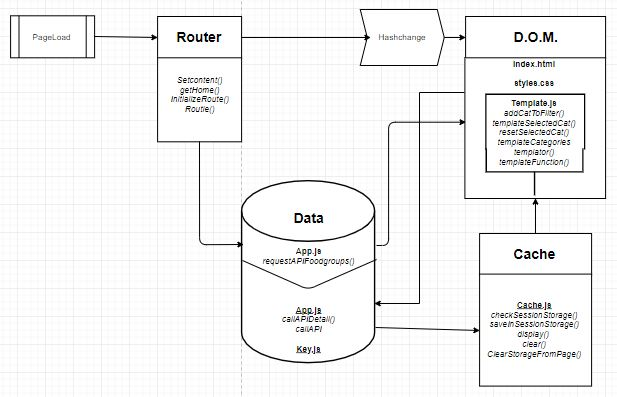

# LOOK UP FOOD NUTRIENTS

## Summary
This is a single page web appication. Users can input a search request and select food categories. The application then looks up foods that are associated with the request. The user can then select a specific product on which the application will display the nutrient content of that specific product.  
The only library it contains is the micro library Routie.

## Table of contents
1. [Live demo](#1-Live-demo)
2. [Install](#2-Install)
3. [Features](#3-Features)
4. [API](#4-API)
5. [Actor Diagram](#5-Actor-Diagram)
6. [Interaction Diagram](#6-Interaction)
7. [Design decisions](#7-Design-decisions)
8. [To-do](#8-To-do)

## 1. Live Demo
https://naughty-wescoff-55a776.netlify.com/#home

## 2. Install
To install the project just fork it and clone it to your device.
Then launch the "v3.0" folder. 

## 3. Features


## 4. API
The data that is collected is served from an API from the United States Department Of Agriculture which is called "USDA Food Composition Database."

Connecting To the API and retrieving food categories:
```js
function requestAPIFoodGroups() {
    //console.log('new api call -- looking up food groups')
    var endpoint = 'https://api.nal.usda.gov/ndb/list?format=json&lt=g&sort=n&api_key=' + key;
    var url = endpoint;
    //console.log('the total url = ' + url)
    fetch(url)
    .then((res) => res.json())
    .then(res => {
        categoryArray.push(res.list);
        
        // send to templating functions

```

Connecting To the API and retrieving product by search input from the user:
```js
function callAPIProducts(fgID) {
    var queryURL = '';
    var url = 'https://api.nal.usda.gov/ndb/search/?format=json&q=' + queryURL + '&sort=n&max=25&offset=0' + fgID + '&api_key=' + key;
    for(var i = 0; i < queryString.length; i++){
        queryURL += (queryString[i])
    }
    
    fetch(url)
    .then((res) => res.json())
    .then((res) => {
        //need to insert caching before templateFunction is called
        templateFunction(res);
        })
        .catch(err => console.log(err));
}

```

Connecting To the API and retrieving nutritional value of 1 specific product:
```js
function callAPI(productNumber) {
    console.log('new api call for ' + productNumber);
    var url = 'https://api.nal.usda.gov/ndb/reports/?ndbno=' + productNumber + '&type=b&format=json&api_key=' + key;
    fetch(url)
    .then((res) => res.json())
    .then(res => {
        for (var i = 0; i < 8; i++) {
            saveInSessionStorage(res, productNumber);
            console.log('sessionStorage.length = ' + sessionStorage.length + ' at the end of script')
            return console.log('________________________________________________________Succesfully Rendered To Template');
        };
    })
    .catch(err => console.log(err));
};

```


## 5. Actor Diagram

## 6. Interaction Diagram

## 7. Design Decisions

## 8. To-do
